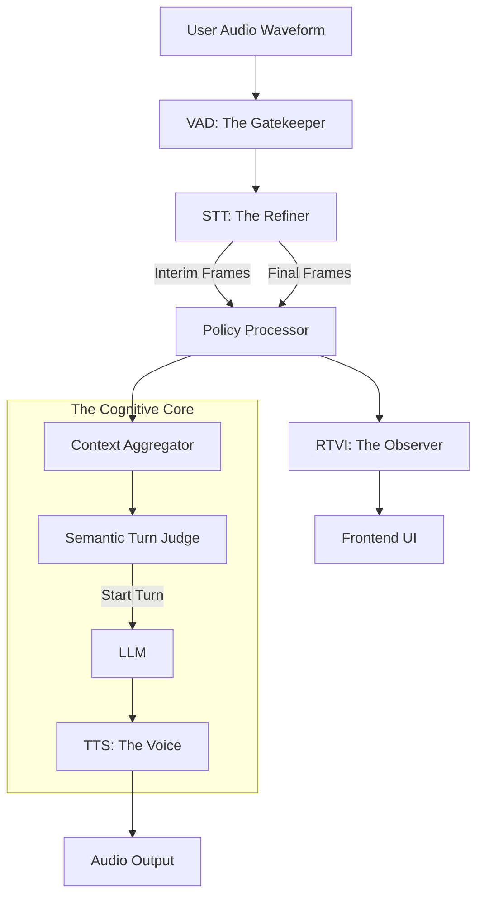

# BOT-EDGE: The Architecture of Instant Presence

> "We are not just moving data. We are engineering the illusion of a shared consciousness."

## 1. The Philosophy: Two-Stream Truth

In the realm of real-time voice AI, we fight a constant war against two enemies: **Latency** and **Inaccuracy**.

*   If you wait for perfect accuracy (final transcription), the bot feels sluggish (high latency).
*   If you react to everything instantly (interim transcription), the bot feels jittery and hallucinates (low accuracy).

**The Bot-Edge Architecture** solves this by accepting a fundamental truth: **The user's speech is not one thing. It is two things happening simultaneously.**

1.  **The Perceptual Stream (Fast/Unstable)**: What the user *sees* on the screen. This must be instantaneous to confirm "I hear you." It is allowed to be imperfect.
2.  **The Cognitive Stream (Slow/Stable)**: What the LLM *thinks* about. This must be accurate to ensure the reply makes sense. It is allowed to be slightly delayed.

`bot-edge.py` is the physical manifestation of this split-brain architecture.

---

## 2. The Pipeline: A Symphony of Filters

A standard pipeline is a straight line. The Edge pipeline is a **refinery**. Crude audio enters one end; refined intent enters the LLM; while a separate byproduct (visual feedback) is tapped off immediately for the user.



### The Component Breakdown

Below is a deconstruction of every organ in this digital body.

---

## 3. The Ear: Local Streaming STT
**Implementation:** `LocalStreamingWhisperSTTService`

### The Concept
Standard Whisper implementation chops audio into 30-second blocks. This is fine for subtitles, but fatal for conversation. We need a "Rolling Buffer" approach.

### How It Works
Instead of waiting for a file, we maintain a `bytearray` buffer in memory. Every 200ms (the `interim_interval`), we feed the *current* buffer to a fast, greedy version of the model.
*   **Beam Size = 1**: We don't need poetry yet; we need speed.
*   **The "Trick"**: We emit `InterimTranscriptionFrame` results constantly. When the VAD says "Silence!", we run one last high-quality pass and emit `TranscriptionFrame` (Final).

### Reimplementing from Scratch (The "No-Pipecat" Way)
If you had to build this without Pipecat, you would:
1.  Open a microphone stream (PyAudio).
2.  Append bytes to a `deque`.
3.  In a separate thread, run `faster_whisper.transcribe(buffer)`.
4.  If the result changes the previous text, send a WebSocket message `{type: "partial", text: "..."}`.
5.  On silence, clear the buffer and send `{type: "final", text: "..."}`.

---

## 4. The Smoother: Transcription Policy
**Implementation:** `TranscriptionPolicyProcessor`

### The Concept
Raw AI output is erratic. It flickers. It says "Um... uh...". If you show this raw feed to a user, they lose trust. The Policy Processor is the **PR Department** of the bot.

### How It Works
It intercepts every text frame.
*   **Interim Policy**: "Keep it simple." Strip trailing punctuation that might flicker (e.g., a flashing period). Lowercase everything to avoid "Title Case Jumps".
*   **Final Policy**: "Make it professional." Ensure proper capitalization and punctuation.

### Reimplementing from Scratch
You would write a middleware function in your WebSocket server:
```python
def process_text(text, is_final):
    if not is_final:
        return text.strip().lower() # Stable, boring representation
    else:
        return restore_punctuation(text) # AI post-processing
```

---

## 5. The Shield: Interim Blocking
**Implementation:** `InterimBlockingFilter`

### The Concept
The LLM is easily confused. If you feed it "I want to...", then "I want to go...", then "I want to go home.", it sees three separate user inputs. It might interrupt you at "I want to".
We need a **Blood-Brain Barrier**.

### How It Works
This simple processor acts as a firewall. It checks the type of every frame.
*   `InterimTranscriptionFrame`? **DROP**. Do not pass to LLM.
*   `TranscriptionFrame`? **PASS**. Proceed to Context.

This ensures the "Cognitive Stream" only ever hears complete thoughts, while the "Perceptual Stream" (via `RTVI` observer) saw the whole typing process.

---

## 6. The Judge: Hybrid Turn Detection
**Implementation:** `VAD` (Silero) + `LocalSmartTurnAnalyzerV3`

### The Concept
When does a turn end?
1.  **Acoustic Stop**: "The energy dropped below -40dB." (The Reptile Brain)
2.  **Semantic Stop**: "The sentence is grammatically complete." (The Higher Brain)

Non-native speakers pause often. A VAD-only system interrupts them constantly. A Semantic-only system never stops listening if there's noise. We need both.

### How It Works
*   **VAD** (`stop_secs=0.8`): Drives the *mechanism*. It decides when to flush the STT buffer.
*   **Semantic Analyzer**: Acts as the *jury*. When the VAD flushes a final transcript, the Analyzer reads it.
    *   *Input*: "I think therefore I am"
    *   *Verdict*: "Complete." -> **LLM Triggered.**
    *   *Input*: "I think therefore" ... (Silence)
    *   *Verdict*: "Incomplete." -> **Wait.** (The buffer clears, but the context accumulation continues).

### Reimplementing from Scratch
You would run a VAD loop. On silence, take the text to a small local LLM (or BERT model):
`completion_score = model.predict("I think therefore")`
If `< 0.8`, keep the microphone open.

---

## 7. The Voice: Low-Latency TTS
**Implementation:** `SpaceAwareTextAggregator`

### The Concept
Standard TTS waits for a full sentence (`.`) to ensure intonation is perfect. This adds latency. The "Edge" approach sacrifices perfect intonation for **instant response**.

### How It Works
Instead of buffering until `.`, we buffer until ` ` (Space).
*   **Old Way**: `User: "Hi"` -> LLM: `"Hello."` -> Wait for `.` -> TTS Audio.
*   **Edge Way**: `User: "Hi"` -> LLMGen: `"Hel"` -> `"Hello"` -> Found Space! -> **TTS Audio**.

This allows the bot to start making sound milliseconds after the first token is generated, overlapping with the rest of the generation.

---

## 8. The Protocol: RTVI
**Implementation:** `RTVIProcessor` & `RTVIObserver`

### The Concept
The bot logic should be separate from the frontend. RTVI (Real-Time Voice Interface) is the **Contract**. It defines a standard JSON protocol for "User spoke", "Bot thinking", "Transcript update".

### How It Works
The `RTVIProcessor` sits at the start of the pipeline. It doesn't modify audio. It watches.
*   When it sees `InterimTranscriptionFrame`, it sends a `bot-transcription` event to the client.
*   When it sees `LLMRunFrame`, it sends a `bot-state: thinking` event.

This decouples the UI from the Python logic. You can swap the Python bot entirely, and the React frontend doesn't care, as long as the RTVI messages remain standard.

---

---

## 9. The Clarifier: Transport Audio Filtering
**Implementation:** `RNNoiseFilter` / `NoisereduceFilter`

### The Concept
Garbage in, garbage out. If the VAD hears a fan, it stays open. If the STT hears a keyboard, it hallucinates words. We must scrub the signal *before* it touches the intelligence.

### 9.1 Filter Selection
*   **RNNoise (Recommended):** An RNN-based noise suppressor. High quality, low latency, handles non-stationary noise (voices, clicks) effectively.
*   **Noisereduce:** Spectral gating. Good for constant hums, but can be aggressive on speech.

### How It Works
We inject a cleaner at the transport layer, filtering the `AudioRawFrame` before it reaches the VAD.
*   **Default**: `AUDIO_FILTER=rnnoise`
*   **Lazy Loading**: The architecture only loads the ML libraries if needed.

---

## 10. The Silencer: Feedback Suppression (Optional)
**Implementation:** `STTMuteFilter`

### The Concept
In loud environments (speakerphone), the microphone hears the bot's own voice. The STT transcribes the bot, the LLM replies to itself, and chaos ensues.

### How It Works
When enabled via `ENABLE_STT_MUTE`, this filter acts as a one-way valve.
*   **Bot Speaking?** -> **Mute Input**. The STT hears silence.
*   **Bot Silent?** -> **Unmute Input**. The User can speak.
*   *Trade-off*: You cannot interrupt the bot if this is on. It is a "Walkie-Talkie" mode for hostile acoustic environments.

---

## 11. The Pulse: Hyper-Observability
**Implementation:** `UserBotLatencyLogObserver` & `MetricsLogObserver`

### The Concept
You cannot optimize what you cannot measure. "It feels slow" is not a bug report. "Latency ended at 203ms" is engineering.

### How It Works
We wrap the pipeline in observers that do not touch the data, but measure its passage.
*   **Turn Latency**: Measures the exact millisecond delta between `VADUserStoppedSpeaking` and `BotStartedSpeaking`.
*   **TTFB**: Tracks the "Time To First Byte" of every LLM and TTS service to spot bottlenecks instantly.

---

## Summary
The `bot-edge.py` is not just script; it is a carefully orchestrated set of parallel processes. It decouples **Speed** (Interim/Display) from **Thought** (Final/Context), allowing us to achieve the holy grail of Voice AI: **The Fast, Patient, Intelligent Agent.**
